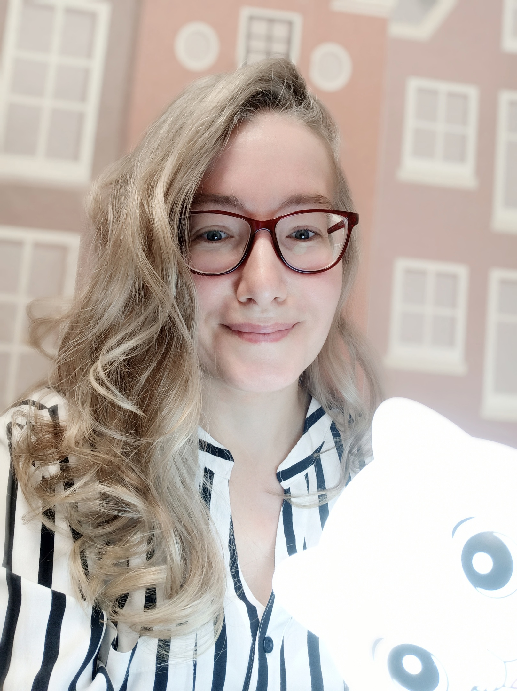

# GalinaBoreal
## About me

> _Something good in everything I see_

I'm from Ural. This is the middle earth of Russia. 
I living a tiny town. There are few interesting plases, but air is cleanest, becouse forest around the town. Summer isn't warm, but winter is very snoving.

---

Я живу в Пермском крае. В этих местах НЕприятный климат, НЕулыбчивые люди. На первый взгляд. На самом деле эти места полны романтики: суровые леса, прекрасные реки, замечательные люди. 

Мне нравится:
- фотографировать
- туризм 
  - рекомендую сплав по реке Чусовая
- котики
  - правда сейчас у меня нет котика

---

Я делаю первые шаги в программировании. Это НЕпростой путь, но я иду по нему, зная, что не все **НЕ** является таковым в реальности.

[Страница VK](https://m.vk.com/id216904669)

galina_ver@mail.ru